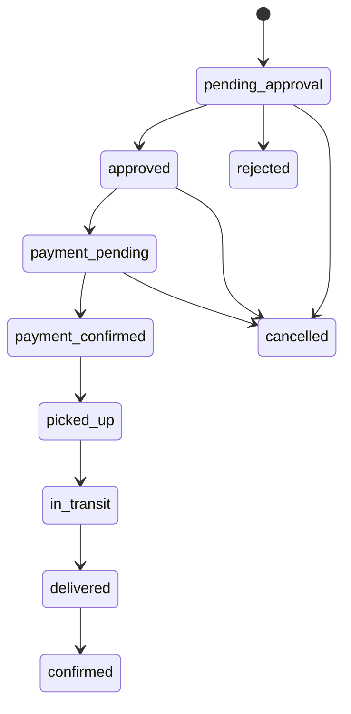

# ✍️ Markdown & Organization

This project uses structured Markdown to maintain a clean "source of truth."

## 🧱 Note Structure
Every feature note should include properties (YAML frontmatter) for Dataview tracking.

```markdown
---
type: feature
phase: 6
status: completed
tags: [payment, backend, api]
---
```

## 🔢 LaTeX for Mathematics
We use LaTeX for documenting the pricing engine logic to ensure the math is unambiguous.

**Pricing Formula:**
$$
\text{subtotal} = \text{base\_price} + (\text{distance\_km} \times \text{per\_km\_rate}) + (\max(\text{weight\_kg} - 1, 0) \times \text{weight\_rate})
$$
$$
\text{total} = \text{round} \left( \frac{\text{subtotal} \times \text{size\_multiplier}}{100} \right)
$$

## 🧜 Mermaid Diagrams
Use Mermaid to visualize the shipment state machine or payment flows.

### Shipment State Machine

