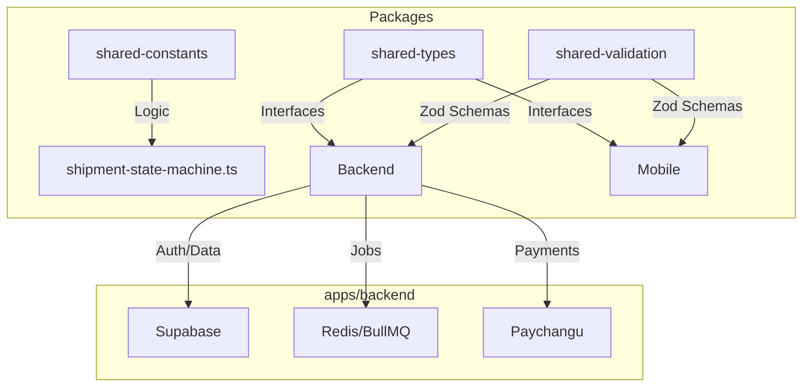

# 🏗️ Architecture Deep Dive

This document explains the high-level architecture and critical business logic flows of the Courier Platform.

## 🌉 The Monorepo Bridge
The platform is designed around "Shared Single Sources of Truth." This ensures that when a business rule changes, it updates everywhere.

## 🔐 Authentication Flow
We use **Supabase Auth** for identity, but we layer a custom **Audit and Profile** system on top.

1. **Mobile Client** calls `POST /auth/register`.
2. **Backend** calls `supabase.auth.signUp()`.
3. **PostgreSQL Trigger** (`handle_new_auth_user`) creates a row in `user_profiles`.
4. **Backend Service** verifies the profile exists and returns a JWT.
5. All subsequent requests carry the JWT in the `Authorization: Bearer` header.

## 💸 Payment & Shipment Atomic Link
One of the most critical parts of the system is ensuring a shipment advances **only** when payment is confirmed.

### The Webhook Lifecycle:
1. **Paychangu** sends a POST request to `/api/v1/webhooks/paychangu`.
2. **`captureRawBody` Middleware** captures the exact bytes for security.
3. **`verifyPaychanguWebhook`** checks the HMAC-SHA256 signature using `PAYCHANGU_WEBHOOK_SECRET`.
4. **`advance_shipment_on_payment` RPC** runs a single PostgreSQL transaction that:
	- Marks `payment.status = 'paid'`.
	- Marks `shipment.status = 'payment_confirmed'`.
	- Injects a record into `shipment_status_events`.
	- Logs the event to `audit_log`.

## 🔢 Pricing Math (Tambala Accuracy)
To prevent floating-point errors (e.g., `0.1 + 0.2 = 0.30000000000000004`), we store all currency as integers in **tambala** (1 MWK = 100 tambala).

**Example Calculation:**
- Base Price: 500,000 (5000 MWK)
- Distance: 312 km
- Rate: 2,000 (20 MWK/km)
- **Math:** `500,000 + (312 * 2,000) = 1,124,000 tambala` (11,240 MWK).

## 🏙️ Geographic Tiers
We calculate distance using a three-tier fallback strategy:
1. **Google Maps Matrix API:** Real road distance between coordinates.
2. **Inter-city Presets:** Fixed road distances between Lilongwe, Blantyre, and Mzuzu.
3. **Default:** A flat 5km fee for same-city deliveries if coordinates are missing.

---
**Next Architectural Phase:** BullMQ Workers for Push Notifications and Stale Payment Expiry.
